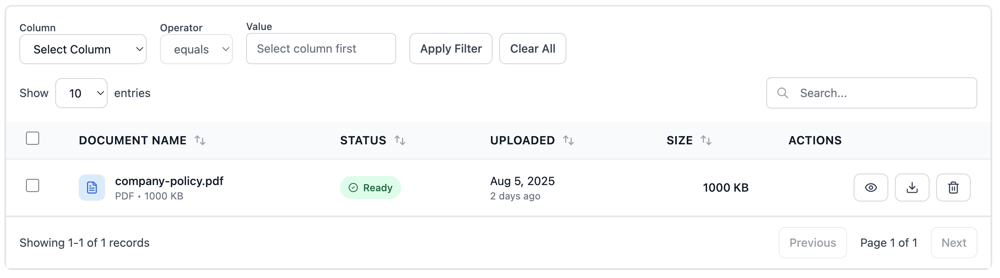
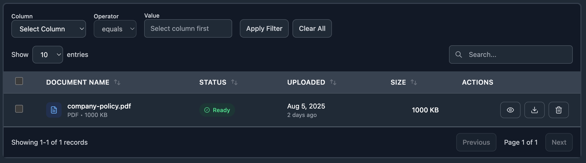

# @reactorui/datagrid

[](https://www.npmjs.com/package/@reactorui/datagrid)
[](https://www.npmjs.com/package/@reactorui/datagrid)
[](https://github.com/your-org/datagrid/blob/main/LICENSE)

A high-performance, feature-rich React data grid component with TypeScript support, server-side integration, pagination and advanced filtering capabilities.

## 🖼️ Screenshots

### Light Mode



### Dark Mode



## ✨ Features

- 🚀 **High Performance** - Optimized rendering and data processing
- 🔍 **Advanced Filtering** - Type-aware filters with multiple operators (string, number, date, boolean)
- 🔄 **Flexible Data Sources** - Static data or server-side with any API
- 📱 **Responsive Design** - Mobile-first with touch-friendly interactions
- 🎨 **Customizable Theming** - Multiple built-in variants and custom styling
- 🌙 **Dark Mode Ready** - Built-in dark mode support with CSS variables
- ♿ **Accessibility First** - WCAG compliant with keyboard navigation and ARIA labels
- 🔧 **TypeScript Native** - Full type safety and comprehensive IntelliSense support
- 🎯 **Rich Event System** - 15+ events covering every user interaction
- 🔐 **Secure Authentication** - Bearer token, API key, and custom header support
- ⚡ **Zero Dependencies** - Only React as peer dependency

## 📦 Installation

```bash
npm install @reactorui/datagrid
# or
yarn add @reactorui/datagrid
# or
pnpm add @reactorui/datagrid
```

## 🚀 Basic Usage

```tsx
import { DataGrid } from '@reactorui/datagrid';

const data = [
  { id: 1, name: 'John Doe', email: 'john@example.com', age: 28 },
  { id: 2, name: 'Jane Smith', email: 'jane@example.com', age: 34 },
];

function App() {
  return <DataGrid data={data} />;
}
```

## 🛠 With Custom Columns & Styling

```tsx
import { DataGrid, Column } from '@reactorui/datagrid';

interface User {
  id: number;
  name: string;
  email: string;
  status: 'active' | 'inactive';
  joinDate: string;
}

const columns: Column<User>[] = [
  {
    key: 'name',
    label: 'Full Name',
    sortable: true,
    render: (value, row) => (
      <div className="flex items-center gap-2">
        <div className="w-8 h-8 bg-blue-500 text-white rounded-full flex items-center justify-center text-sm">
          {value.charAt(0)}
        </div>
        {value}
      </div>
    ),
  },
  { key: 'email', label: 'Email Address', sortable: true },
  {
    key: 'status',
    label: 'Status',
    dataType: 'string',
    render: (status) => (
      <span
        className={`px-2 py-1 text-xs font-medium rounded-full ${
          status === 'active' ? 'bg-green-100 text-green-800' : 'bg-red-100 text-red-800'
        }`}
      >
        {status}
      </span>
    ),
  },
  {
    key: 'joinDate',
    label: 'Join Date',
    dataType: 'date',
    sortable: true,
  },
];

function App() {
  return (
    <DataGrid
      data={users}
      columns={columns}
      variant="bordered"
      size="comfortable"
      enableSelection={true}
      onSelectionChange={(selected) => console.log('Selected:', selected)}
    />
  );
}
```

## 🌐 Server-Side Data

```tsx
import { DataGrid } from '@reactorui/datagrid';

function App() {
  return (
    <DataGrid
      endpoint="/api/users"
      httpConfig={{
        bearerToken: 'your-jwt-token',
        method: 'POST',
        postDataFormat: 'json',
        customHeaders: {
          'X-Custom-Header': 'value',
        },
      }}
      serverPageSize={100}
      pageSize={25}
      onDataLoad={(data) => console.log(`Loaded ${data.items.length} items`)}
      onDataError={(error, context) => console.error(`Error in ${context}:`, error)}
    />
  );
}
```

## 🎯 Comprehensive Event System

The DataGrid provides 15+ events covering every user interaction:

```tsx
<DataGrid
  data={users}
  // Data loading events
  onDataLoad={(data) => {
    console.log('Data loaded:', data.items.length);
    hideLoadingSpinner();
  }}
  onDataError={(error, context) => {
    console.error(`Error in ${context}:`, error.message);
    showErrorToast(error.message);
  }}
  onLoadingStateChange={(loading, context) => {
    setIsLoading(loading);
    console.log(`${context} loading: ${loading}`);
  }}
  // Pagination events
  onPageChange={(page, paginationInfo) => {
    console.log(`Page ${page} of ${paginationInfo.totalPages}`);
    updateUrl(`?page=${page}`);
  }}
  onPageSizeChange={(pageSize, paginationInfo) => {
    console.log(`Showing ${pageSize} items per page`);
    saveUserPreference('pageSize', pageSize);
  }}
  // Interaction events
  onSortChange={(sortConfig) => {
    console.log(`Sorted by ${sortConfig.column} ${sortConfig.direction}`);
    updateUrl(`?sort=${sortConfig.column}&order=${sortConfig.direction}`);
  }}
  onFilterChange={(filters) => {
    console.log(`${filters.length} filters active`);
    setBadgeCount(filters.length);
  }}
  onSearchChange={(searchTerm) => {
    console.log(`Searching for: "${searchTerm}"`);
    trackSearchQuery(searchTerm);
  }}
  onTableRefresh={() => {
    console.log('Table refreshed');
    showSuccessMessage('Data refreshed');
  }}
/>
```

**Row & Cell Interaction Events**<br>

```tsx
<DataGrid
  data={users}
  // Row interaction events
  onTableRowClick={(row, event) => {
    console.log('Row clicked:', row.name);
    highlightRow(row.id);
  }}
  onTableRowDoubleClick={(row, event) => {
    console.log('Row double-clicked:', row.name);
    openEditModal(row);
    return false; // Prevent default selection behavior
  }}
  onTableRowHover={(row, event) => {
    if (row) {
      console.log('Hovering over:', row.name);
      showPreviewTooltip(row);
    } else {
      hidePreviewTooltip();
    }
  }}
  // Selection events
  onRowSelect={(row, isSelected) => {
    console.log(`${row.name} ${isSelected ? 'selected' : 'deselected'}`);
    updateRowActions(row, isSelected);
  }}
  onSelectionChange={(selectedRows) => {
    console.log(`${selectedRows.length} rows selected`);
    setBulkActionsEnabled(selectedRows.length > 0);
    updateSelectionToolbar(selectedRows);
  }}
  // Cell interaction events
  onCellClick={(value, row, column, event) => {
    console.log(`Clicked ${column.label}: ${value}`);
    if (column.key === 'email') {
      window.open(`mailto:${value}`);
    }
  }}
/>
```

## Real-World Event Usage Example

```tsx
import React, { useState } from 'react';
import { DataGrid } from '@reactorui/datagrid';

function UserManagement() {
  const [loading, setLoading] = useState(false);
  const [selectedUsers, setSelectedUsers] = useState([]);
  const [currentPage, setCurrentPage] = useState(1);

  return (
    <div>
      {/* Bulk Actions Toolbar */}
      {selectedUsers.length > 0 && (
        <div className="bg-blue-50 p-4 mb-4 rounded">
          <span className="font-medium">{selectedUsers.length} users selected</span>
          <div className="ml-4 space-x-2">
            <button onClick={() => bulkExport(selectedUsers)}>Export</button>
            <button onClick={() => bulkDeactivate(selectedUsers)}>Deactivate</button>
            <button onClick={() => bulkDelete(selectedUsers)}>Delete</button>
          </div>
        </div>
      )}

      {/* DataGrid with comprehensive event handling */}
      <DataGrid
        endpoint="/api/users"
        enableSelection={true}
        // Sync with component state
        onLoadingStateChange={(loading) => setLoading(loading)}
        onPageChange={(page) => setCurrentPage(page)}
        onSelectionChange={(users) => setSelectedUsers(users)}
        // User interaction handlers
        onTableRowDoubleClick={(user) => openUserProfile(user.id)}
        onDataError={(error) => showErrorNotification(error.message)}
        onTableRefresh={() => showSuccessMessage('Users refreshed')}
        // Analytics tracking
        onSearchChange={(term) => analytics.track('users_searched', { term })}
        onSortChange={(sort) => analytics.track('users_sorted', { column: sort.column })}
        onFilterChange={(filters) => analytics.track('users_filtered', { count: filters.length })}
      />

      {/* Status indicators */}
      <div className="mt-4 text-sm text-gray-500">
        Page {currentPage} • {selectedUsers.length} selected • {loading ? 'Loading...' : 'Ready'}
      </div>
    </div>
  );
}
```

## Column Configuration

```tsx
interface Column<T> {
  key: keyof T | string; // Data property key
  label: string; // Display header label
  sortable?: boolean; // Enable sorting (default: true)
  filterable?: boolean; // Enable in advanced filters (default: true)
  dataType?: 'string' | 'number' | 'boolean' | 'date' | 'datetime';
  width?: string | number; // Fixed column width
  minWidth?: string | number; // Minimum column width
  maxWidth?: string | number; // Maximum column width
  align?: 'left' | 'center' | 'right';
  render?: (value: any, row: T, index: number) => ReactNode;
}
```

## HTTP Configuration

```tsx
interface HttpConfig {
  bearerToken?: string; // Authorization: Bearer <token>
  apiKey?: string; // X-API-Key header
  customHeaders?: Record<string, string>;
  method?: 'GET' | 'POST'; // HTTP method (default: GET)
  postDataFormat?: 'form' | 'json'; // POST body format
  withCredentials?: boolean; // Include cookies
  timeout?: number; // Request timeout in ms
}
```

# Server Request & Response Format

**Request sent to your API:**

```tsx
interface ServerRequest {
  page: number; // Current page number
  pageSize: number; // Items per page
  search: string; // Global search term
  sortColumn: string; // Column to sort by
  filters: ActiveFilter[]; // Applied filters
  continuationToken: // Token to grab more records (For server side pagination, if enabled)
}
```

**Expected response format:**

```tsx
interface ServerResponse<T> {
  items: T[]; // Data array for current page
  count: number; // Total number of records
  hasMore: boolean; // Whether more pages available
  continuationToken: string; // Token to grab more records (For server side pagination, if enabled)
}
```

## Event Callbacks

| **Event**               | **Signature**                                                        | **Description**                              |
| ----------------------- | -------------------------------------------------------------------- | -------------------------------------------- |
| **Data & State Events** |                                                                      |                                              |
| `onDataLoad`            | `(data: ServerResponse<T>) => void`                                  | Called when server data loads successfully   |
| `onDataError`           | `(error: Error, context: string) => void`                            | Called when any error occurs                 |
| `onLoadingStateChange`  | `(loading: boolean, context: string) => void`                        | Called when loading state changes            |
| `onPageChange`          | `(page: number, paginationInfo: PaginationInfo) => void`             | Called when user navigates pages             |
| `onPageSizeChange`      | `(size: number, paginationInfo: PaginationInfo) => void`             | Called when page size changes                |
| `onSortChange`          | `(sortConfig: SortConfig) => void`                                   | Called when sorting changes                  |
| `onFilterChange`        | `(filters: ActiveFilter[]) => void`                                  | Called when filters change                   |
| `onSearchChange`        | `(searchTerm: string) => void`                                       | Called when search term changes              |
| `onTableRefresh`        | `() => void`                                                         | Called when refresh is triggered             |
| **Row & Cell Events**   |                                                                      |                                              |
| `onTableRowClick`       | `(row: T, event: MouseEvent) => void`                                | Called on single row click                   |
| `onTableRowDoubleClick` | `(row: T, event: MouseEvent) => boolean \| void`                     | Called on row double-click                   |
| `onRowSelect`           | `(row: T, isSelected: boolean) => void`                              | Called when individual row selection changes |
| `onSelectionChange`     | `(selectedRows: T[]) => void`                                        | Called when overall selection changes        |
| `onBulkDelete`          | `(rows: T[]) => void`                                                | Called when delete button is clicked         |
| `onTableRowHover`       | `(row: T \| null, event: MouseEvent) => void`                        | Called when hovering over rows               |
| `onCellClick`           | `(value: any, row: T, column: Column<T>, event: MouseEvent) => void` | Called when clicking individual cells        |

### **DataGrid Props**

| **Prop**               | **Type**                               | **Default**        | **Description**                          |
| ---------------------- | -------------------------------------- | ------------------ | ---------------------------------------- |
| **Data Configuration** |                                        |                    |                                          |
| `data`                 | `T[]`                                  | –                  | Static data array for client-side mode   |
| `endpoint`             | `string`                               | –                  | API endpoint for server-side data        |
| `columns`              | `Column<T>[]`                          | Auto-detected      | Column configuration array               |
| **Feature Toggles**    |                                        |                    |                                          |
| `enableSearch`         | `boolean`                              | `true`             | Enable global search functionality       |
| `enableSorting`        | `boolean`                              | `true`             | Enable column sorting                    |
| `enableFilters`        | `boolean`                              | `true`             | Enable advanced filtering                |
| `enableSelection`      | `boolean`                              | `true`             | Enable row selection with checkboxes     |
| `enableRefresh`        | `boolean`                              | `false`            | Show/hide the refresh button             |
| `enableDelete`         | `boolean`                              | `false`            | Enable bulk delete functionality         |
| `deleteConfirmation`   | `boolean`                              | `false`            | Show confirmation dialog for delete      |
| **Pagination**         |                                        |                    |                                          |
| `pageSize`             | `number`                               | `10`               | Client-side pagination size              |
| `serverPageSize`       | `number`                               | `100`              | Server request batch size                |
| `pageSizeOptions`      | `number[]`                             | `[5,10,25,50,100]` | Available page size options              |
| **Styling**            |                                        |                    |                                          |
| `variant`              | `'default' \| 'striped' \| 'bordered'` | `'default'`        | Visual theme variant                     |
| `size`                 | `'sm' \| 'md' \| 'lg'`                 | `'md'`             | Size variant for padding and text        |
| `className`            | `string`                               | `''`               | Additional CSS classes                   |
| **HTTP Configuration** |                                        |                    |                                          |
| `httpConfig`           | `HttpConfig`                           | –                  | Authentication and request configuration |

## 🎨 Theming & Styling

```tsx
// Clean, minimal design
<DataGrid variant="default" data={data} />

// Alternating row colors
<DataGrid variant="striped" data={data} />

// Full borders around cells
<DataGrid variant="bordered" data={data} />
```

**Size Variants**

```tsx
// Compact spacing
<DataGrid size="sm" data={data} />

// Standard spacing (default)
<DataGrid size="md" data={data} />

// Comfortable spacing
<DataGrid size="lg" data={data} />
```

**Dark Mode Support**<br>
The DataGrid automatically adapts to dark mode when using Tailwind CSS:

```tsx
// Wrap in dark mode provider
<div className="dark">
  <DataGrid data={data} />
</div>
```

**Custom Styling**<br>

```tsx
<DataGrid
  data={data}
  className="shadow-xl rounded-xl overflow-hidden"
  // Add custom CSS classes for complete control
/>
```

## Delete Functionality

The delete button appears next to the search input and shows the selection count:

<pre> ``` [Show 10 entries] ........................... [🔍 Search...][🗑️ (3 selected)] ``` </pre>

- Button is **disabled** when no rows are selected
- Shows **selection count** when items are selected
- Supports **built-in confirmation dialog**
- Only appears when **both** `enableDelete={true}` and `enableSelection={true}`

## 🔧 Advanced Usage

**Custom Styling**<br>

```tsx
const columns: Column<Employee>[] = [
  {
    key: 'employee',
    label: 'Employee',
    render: (_, employee) => (
      <div className="flex items-center space-x-3">
        
        <div>
          <div className="font-medium">{employee.name}</div>
          <div className="text-sm text-gray-500">{employee.title}</div>
        </div>
      </div>
    ),
  },
  {
    key: 'performance',
    label: 'Performance',
    render: (score) => (
      <div className="flex items-center">
        <div className="flex-1 bg-gray-200 rounded-full h-2 mr-2">
          <div className="bg-blue-500 h-2 rounded-full" style={{ width: `${score}%` }} />
        </div>
        <span className="text-sm font-medium">{score}%</span>
      </div>
    ),
  },
];
```

**Advanced Filtering**

```tsx
// The DataGrid automatically provides appropriate filter inputs:
// - String: text input with contains/equals/starts with/ends with
// - Number: number input with comparison operators
// - Date: date picker with before/after/on
// - Boolean: dropdown with true/false options

const columns = [
  { key: 'name', label: 'Name', dataType: 'string' },
  { key: 'salary', label: 'Salary', dataType: 'number' },
  { key: 'startDate', label: 'Start Date', dataType: 'date' },
  { key: 'isActive', label: 'Active', dataType: 'boolean' },
];
```

**Real-time Data with WebSockets**

```tsx
function LiveDataGrid() {
  const [data, setData] = useState([]);

  useEffect(() => {
    const ws = new WebSocket('ws://localhost:8080');
    ws.onmessage = (event) => {
      const updatedData = JSON.parse(event.data);
      setData(updatedData);
    };
    return () => ws.close();
  }, []);

  return (
    <DataGrid
      data={data}
      onTableRefresh={() => {
        // Trigger server refresh
        fetch('/api/refresh', { method: 'POST' });
      }}
    />
  );
}
```

## 🌍 Server Integration Examples

**Node.js/Expresse**

```tsx
app.post('/api/users', async (req, res) => {
  const { page, pageSize, search, filters, continuationToken } = JSON.parse(req.body.request);

  let query = User.find();

  // Apply search
  if (search) {
    query = query.where({
      $or: [
        { name: { $regex: search, $options: 'i' } },
        { email: { $regex: search, $options: 'i' } },
      ],
    });
  }

  // Apply filters
  filters.forEach((filter) => {
    query = query.where(filter.column)[getOperator(filter.operator)](filter.value);
  });

  // Handle continuation token (simple ID-based cursor)
  if (continuationToken) {
    const { lastId } = JSON.parse(Buffer.from(continuationToken, 'base64').toString());
    query = query.where('_id').gt(lastId);
  }

  // Execute query
  const items = await query.limit(pageSize + 1);
  const hasMore = items.length > pageSize;
  const resultItems = hasMore ? items.slice(0, pageSize) : items;

  // Generate next token
  let nextToken;
  if (hasMore && resultItems.length > 0) {
    const lastItem = resultItems[resultItems.length - 1];
    nextToken = Buffer.from(JSON.stringify({ lastId: lastItem._id })).toString('base64');
  }

  res.json({
    items: resultItems, // lowercase works
    continuationToken: nextToken, // camelCase works
    hasMore: hasMore, // camelCase works
    count: resultItems.length, // lowercase works
  });
});
```

**ASP.Net Core**

```tsx
[HttpPost("api/users")]
public async Task<IActionResult> GetUsers([FromBody] DataTableRequest request)
{
    var query = _context.Users.AsQueryable();

    // Apply search
    if (!string.IsNullOrEmpty(request.Search))
        query = query.Where(u => u.Name.Contains(request.Search) || u.Email.Contains(request.Search));

    // Apply filters
    foreach (var filter in request.Filters)
        query = ApplyFilter(query, filter);

    // Handle continuation token
    if (!string.IsNullOrEmpty(request.ContinuationToken))
    {
        var token = JsonSerializer.Deserialize<ContinuationToken>(
            Encoding.UTF8.GetString(Convert.FromBase64String(request.ContinuationToken)));
        query = query.Where(u => u.Id > token.LastId);
    }

    query = query.OrderBy(u => u.Id);
    var items = await query.Take(request.PageSize + 1).ToListAsync();
    var hasMore = items.Count > request.PageSize;
    var resultItems = hasMore ? items.Take(request.PageSize).ToList() : items;

    string nextToken = null;
    if (hasMore && resultItems.Any())
    {
        var lastItem = resultItems.Last();
        var tokenData = new ContinuationToken { LastId = lastItem.Id };
        nextToken = Convert.ToBase64String(Encoding.UTF8.GetBytes(JsonSerializer.Serialize(tokenData)));
    }

    return Ok(new
    {
        Items = resultItems,                    // PascalCase works
        ContinuationToken = nextToken,          // PascalCase works
        HasMore = hasMore,                      // PascalCase works
        Count = resultItems.Count               // PascalCase works
    });
}
```

**Laravel/PHP**

```tsx
Route::post('/api/users', function (Request $request) {
    $requestData = json_decode($request->input('request'), true);
    $query = User::query();

    // Apply search
    if (!empty($requestData['search'])) {
        $query->where(function($q) use ($requestData) {
            $q->where('name', 'like', "%{$requestData['search']}%")
              ->orWhere('email', 'like', "%{$requestData['search']}%");
        });
    }

    // Apply filters
    foreach ($requestData['filters'] as $filter) {
        $query->where($filter['column'], $filter['operator'], $filter['value']);
    }

    // Handle continuation token
    if (!empty($requestData['continuationToken'])) {
        $tokenData = json_decode(base64_decode($requestData['continuationToken']), true);
        $query->where('id', '>', $tokenData['lastId']);
    }

    $query->orderBy('id', 'asc');
    $items = $query->take($requestData['pageSize'] + 1)->get();
    $hasMore = $items->count() > $requestData['pageSize'];
    $resultItems = $hasMore ? $items->take($requestData['pageSize']) : $items;

    $nextToken = null;
    if ($hasMore && $resultItems->isNotEmpty()) {
        $lastItem = $resultItems->last();
        $nextToken = base64_encode(json_encode(['lastId' => $lastItem->id]));
    }

    return response()->json([
        'data' => $resultItems->values(),       // Laravel convention works
        'continuation_token' => $nextToken,     // snake_case works
        'has_more' => $hasMore,                // snake_case works
        'total' => $resultItems->count()       // Laravel convention works
    ]);
});
```

## 🧪 Testing

```bash
# Run test suite
npm test

# Watch mode for development
npm run test:watch

# Coverage report
npm run test:coverage
```

**Testing with Jest & React Testing Library**

```tsx
import { render, screen, fireEvent } from '@testing-library/react';
import { DataGrid } from '@reactorui/datagrid';

test('handles user interactions', () => {
  const onSelectionChange = jest.fn();
  const testData = [{ id: 1, name: 'John', email: 'john@test.com' }];

  render(<DataGrid data={testData} onSelectionChange={onSelectionChange} />);

  // Test search
  fireEvent.change(screen.getByPlaceholderText('Search...'), {
    target: { value: 'John' },
  });

  // Test selection
  fireEvent.click(screen.getAllByRole('checkbox')[1]);

  expect(onSelectionChange).toHaveBeenCalledWith([testData[0]]);
});
```

## 📚 Examples

Check out the examples/ directory for complete working examples:

examples/basic/ - Simple usage with auto-detected columns
examples/advanced/ - Custom columns, renderers, and styling
examples/events/ - Comprehensive event handling demonstration

## 🚀 Performance Tips

Use server-side pagination for datasets > 1000 records
Implement custom renderers efficiently with React.memo
Debounce search for better UX with large datasets
Use specific column keys instead of auto-detection for better performance

```tsx
const StatusBadge = React.memo(({ status }: { status: string }) => (
  <span className={`badge ${status === 'active' ? 'bg-green' : 'bg-red'}`}>{status}</span>
));

// Debounced search
const [debouncedSearch] = useDebounce(searchTerm, 300);
```

## 🔧 Development

```bash
# Install dependencies
npm install

# Run tests
npm test

# Build library
npm run build

# Type checking
npm run typecheck

# Linting
npm run lint

# Format code
npm run format
```

## 🤝 Contributing

We welcome contributions! Please see our Contributing Guide for details.

Fork the repository
Create your feature branch (git checkout -b feature/amazing-feature)
Write tests for your changes
Commit your changes (git commit -m 'Add amazing feature')
Push to the branch (git push origin feature/amazing-feature)
Open a Pull Request

## 📄 License

MIT License - see [LICENSE](LICENSE) file for details.

## Related Projects

Part of the ReactorUI ecosystem:

- 📊 [@reactorui/recurrence](https://www.npmjs.com/package/@reactorui/recurrence) - A powerful, flexible recurrence rule builder for React applications
- 🔜 More components coming soon!

---

**Made with ❤️ by ReactorUI**
