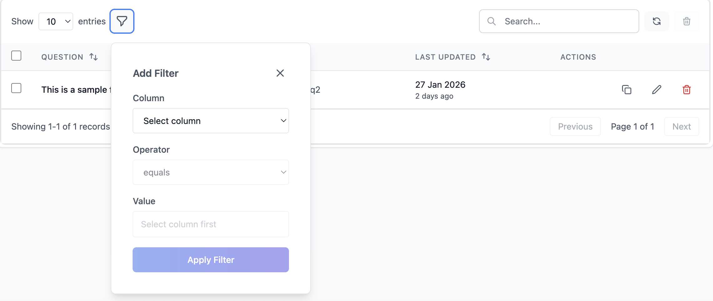
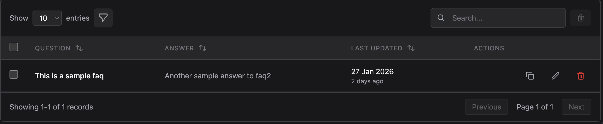

# @reactorui/datagrid

[](https://www.npmjs.com/package/@reactorui/datagrid)
[](https://www.npmjs.com/package/@reactorui/datagrid)
[](https://github.com/your-org/datagrid/blob/main/LICENSE)

A high-performance, feature-rich React data grid component with TypeScript support, pagination, and advanced filtering capabilities. Designed as a **controlled presentation component** for maximum flexibility.

## 🖼️ Screenshots

### Light Mode



### Dark Mode



## ✨ Features

- 🚀 **High Performance** - Optimized rendering with memoization
- 🔍 **Advanced Filtering** - Type-aware filters with multiple operators (string, number, date, boolean)
- 🔄 **Flexible Data Sources** - Works with any data fetching strategy (REST, GraphQL, local)
- 📱 **Responsive Design** - Mobile-first with touch-friendly interactions
- 🎨 **Fully Customizable Theming** - Pass custom theme objects to match your design system
- 🌙 **Dark Mode Ready** - Built-in dark mode support with zinc palette option
- ♿ **Accessibility First** - WCAG compliant with keyboard navigation and ARIA labels
- 🔧 **TypeScript Native** - Full type safety and comprehensive IntelliSense support
- 🎯 **Rich Event System** - 20+ events covering every user interaction
- 📊 **Granular Loading States** - Action-specific loading indicators
- 📜 **Scrollable Layout** - Fixed headers with `maxHeight` and `stickyHeader` props
- ⚡ **Zero Dependencies** - Only React as peer dependency

## 📦 Installation

```bash
npm install @reactorui/datagrid
# or
yarn add @reactorui/datagrid
# or
pnpm add @reactorui/datagrid
```

## 🚀 Basic Usage

```tsx
import { DataGrid } from '@reactorui/datagrid';

const data = [
  { id: 1, name: 'John Doe', email: 'john@example.com', age: 28 },
  { id: 2, name: 'Jane Smith', email: 'jane@example.com', age: 34 },
];

function App() {
  return <DataGrid data={data} />;
}
```

## 🛠 With Custom Columns & Styling

```tsx
import { DataGrid, Column } from '@reactorui/datagrid';

interface User {
  id: number;
  name: string;
  email: string;
  status: 'active' | 'inactive';
  joinDate: string;
}

const columns: Column<User>[] = [
  {
    key: 'name',
    label: 'Full Name',
    sortable: true,
    render: (value, row) => (
      <div className="flex items-center gap-2">
        <div className="w-8 h-8 bg-blue-500 text-white rounded-full flex items-center justify-center text-sm">
          {value.charAt(0)}
        </div>
        {value}
      </div>
    ),
  },
  { key: 'email', label: 'Email Address', sortable: true },
  {
    key: 'status',
    label: 'Status',
    dataType: 'string',
    render: (status) => (
      <span
        className={`px-2 py-1 text-xs font-medium rounded-full ${
          status === 'active' ? 'bg-green-100 text-green-800' : 'bg-red-100 text-red-800'
        }`}
      >
        {status}
      </span>
    ),
  },
  {
    key: 'joinDate',
    label: 'Join Date',
    dataType: 'date',
    sortable: true,
  },
];

function App() {
  return (
    <DataGrid
      data={users}
      columns={columns}
      variant="bordered"
      size="lg"
      enableSelection={true}
      onSelectionChange={(selected) => console.log('Selected:', selected)}
    />
  );
}
```

## 🎨 Custom Theming

The DataGrid supports full theme customization via the `theme` prop. You can override any part of the default theme to match your design system.

### Theme Interface

```tsx
interface Theme {
  // Container
  container: string;

  // Table
  table: string;
  header: string;
  headerCell: string;
  row: string;
  cell: string;
  selectedRow: string;

  // Controls
  searchInput: string;
  select: string;
  button: string;
  buttonSecondary: string;
  buttonDanger: string;

  // Text
  text: string;
  textMuted: string;
  textError: string;

  // Pagination
  pagination: string;
  paginationButton: string;
  paginationText: string;

  // States
  loadingSkeleton: string;
  emptyState: string;
  errorState: string;

  // Filter
  filterDropdown: string;
  filterTag: string;
  filterTagRemove: string;
}
```

### Custom Theme Example

```tsx
import { DataGrid, Theme } from '@reactorui/datagrid';

// Define your custom theme (partial overrides supported)
const myTheme: Partial<Theme> = {
  container: 'bg-white dark:bg-zinc-900 rounded-xl border border-zinc-200 dark:border-zinc-700',
  row: 'bg-white dark:bg-zinc-900 hover:bg-zinc-50 dark:hover:bg-zinc-800',
  cell: 'px-4 py-3 text-sm text-gray-900 dark:text-zinc-100 border-b dark:border-zinc-700',
  searchInput:
    'px-3 py-2 border dark:border-zinc-700 rounded-lg dark:bg-zinc-800 dark:text-zinc-100',
  pagination:
    'flex items-center justify-between px-4 py-3 dark:bg-zinc-900 border-t dark:border-zinc-700',
};

function App() {
  return <DataGrid data={data} theme={myTheme} />;
}
```

### Using createZincTheme Helper

For projects using the `zinc` color palette (like Tailwind's neutral grays), use the built-in helper:

```tsx
import { DataGrid, createZincTheme } from '@reactorui/datagrid';

// Creates a complete theme with zinc palette for dark mode
const zincTheme = createZincTheme('default'); // or 'striped' or 'bordered'

function App() {
  return <DataGrid data={data} theme={zincTheme} />;
}
```

### Theme + Variant

Custom themes merge with the selected variant:

```tsx
// Striped variant + custom zinc dark mode
<DataGrid
  data={data}
  variant="striped"
  theme={{
    container: 'bg-white dark:bg-zinc-900 rounded-xl',
    row: 'odd:bg-white dark:odd:bg-zinc-900 even:bg-zinc-50 dark:even:bg-zinc-800/50',
  }}
/>
```

### Integration with Design Systems

Example integrating with a custom ThemeStyles system:

```tsx
// utils/dataGridTheme.ts
import { Theme } from '@reactorui/datagrid';

export const appDataGridTheme: Partial<Theme> = {
  container:
    'bg-white dark:bg-zinc-900 rounded-lg shadow-sm border border-gray-200 dark:border-zinc-700',
  table: 'w-full bg-white dark:bg-zinc-900',
  header: 'bg-gray-50 dark:bg-zinc-800 border-b border-gray-200 dark:border-zinc-700',
  headerCell: 'px-4 py-3 text-left text-xs font-medium text-gray-500 dark:text-zinc-400 uppercase',
  row: 'bg-white dark:bg-zinc-900 hover:bg-gray-50 dark:hover:bg-zinc-800 transition-colors',
  cell: 'px-4 py-3 text-sm text-gray-900 dark:text-zinc-100 border-b dark:border-zinc-700',
  selectedRow: 'bg-blue-50 dark:bg-blue-900/20 hover:bg-blue-100 dark:hover:bg-blue-900/30',
  searchInput:
    'px-3 py-2 border dark:border-zinc-700 rounded-md dark:bg-zinc-800 dark:text-zinc-100',
  select: 'px-2 py-1 border dark:border-zinc-700 rounded dark:bg-zinc-800 dark:text-zinc-100',
  button: 'px-3 py-2 bg-blue-600 text-white rounded-md hover:bg-blue-700',
  buttonSecondary:
    'px-3 py-2 bg-gray-100 dark:bg-zinc-800 text-gray-700 dark:text-zinc-300 rounded-md',
  text: 'text-gray-700 dark:text-zinc-300',
  textMuted: 'text-gray-500 dark:text-zinc-500',
  textError: 'text-red-600 dark:text-red-400',
  pagination:
    'flex items-center justify-between px-4 py-3 dark:bg-zinc-900 border-t dark:border-zinc-700',
  paginationButton: 'px-3 py-1 text-sm border dark:border-zinc-700 rounded dark:bg-zinc-800',
  paginationText: 'text-sm text-gray-700 dark:text-zinc-300',
  emptyState: 'text-gray-500 dark:text-zinc-400',
  filterDropdown:
    'absolute z-50 mt-2 bg-white dark:bg-zinc-800 border dark:border-zinc-700 rounded-lg shadow-lg',
  filterTag:
    'inline-flex items-center gap-1 px-2 py-1 text-xs bg-blue-100 dark:bg-blue-900/30 text-blue-700 dark:text-blue-300 rounded-md',
};

// Usage
import { appDataGridTheme } from './utils/dataGridTheme';

<DataGrid data={data} theme={appDataGridTheme} />;
```

## 🌐 Server-Side Data (Controlled Mode)

The DataGrid is a **controlled presentation component**. You handle data fetching; the grid handles display.

```tsx
import { useState, useEffect } from 'react';
import { DataGrid, LoadingState, ActiveFilter, SortConfig } from '@reactorui/datagrid';

function ServerSideExample() {
  const [data, setData] = useState([]);
  const [loadingState, setLoadingState] = useState<LoadingState>({});
  const [totalRecords, setTotalRecords] = useState(0);
  const [currentPage, setCurrentPage] = useState(1);
  const [error, setError] = useState<string | null>(null);

  // Fetch data from your API
  const fetchData = async (page: number, filters: ActiveFilter[], search: string) => {
    setLoadingState({ data: true });
    setError(null);

    try {
      const response = await fetch('/api/users', {
        method: 'POST',
        headers: { 'Content-Type': 'application/json' },
        body: JSON.stringify({ page, pageSize: 25, filters, search }),
      });

      const result = await response.json();
      setData(result.items);
      setTotalRecords(result.totalRecords);
    } catch (err) {
      setError('Failed to load data');
    } finally {
      setLoadingState({});
    }
  };

  useEffect(() => {
    fetchData(1, [], '');
  }, []);

  return (
    <DataGrid
      data={data}
      loading={loadingState}
      totalRecords={totalRecords}
      currentPage={currentPage}
      error={error}
      pageSize={25}
      // Filter callbacks - YOU handle the server call
      onApplyFilter={(filter, allFilters) => {
        setLoadingState({ filter: true });
        fetchData(1, allFilters, '');
      }}
      onClearFilters={() => {
        fetchData(1, [], '');
      }}
      onSearchChange={(term) => {
        setLoadingState({ search: true });
        fetchData(1, [], term);
      }}
      onPageChange={(page) => {
        setCurrentPage(page);
        fetchData(page, [], '');
      }}
      onTableRefresh={() => {
        setLoadingState({ refresh: true });
        fetchData(currentPage, [], '');
      }}
    />
  );
}
```

## 📊 Granular Loading States

Instead of a single `loading` boolean, use `loadingState` for action-specific feedback:

```tsx
interface LoadingState {
  data?: boolean;     // Shows skeleton, disables all controls
  filter?: boolean;   // Spinner on "Apply Filter" button only
  search?: boolean;   // Spinner in search input only
  refresh?: boolean;  // Spinner on refresh button only
  delete?: boolean;   // Spinner on delete button only
}

// Usage
<DataGrid
  data={data}
  loadingState={{ filter: true }}  // Only Apply Filter shows spinner
/>

// Backward compatible - still works
<DataGrid data={data} loading={true} />
```

**Visual Result:**

- Click "Apply Filter" → only that button shows `[⟳ Applying...]`
- Click "Refresh" → only that button spins
- Click "Delete" → only that button shows `[⟳ Deleting...]`
- Initial load → table skeleton, all controls disabled

## 📜 Scrollable Layout

For large datasets, enable scrollable body with fixed headers:

```tsx
// Fixed pixel height
<DataGrid data={data} maxHeight="400px" />

// Viewport-relative height
<DataGrid data={data} maxHeight="60vh" />

// Dynamic height
<DataGrid data={data} maxHeight="calc(100vh - 200px)" />

// Just sticky headers (browser determines scroll)
<DataGrid data={data} stickyHeader={true} />

// Numeric value (converted to pixels)
<DataGrid data={data} maxHeight={500} />
```

## 🎯 Event System

### Filter Events

```tsx
<DataGrid
  data={data}
  enableFilters={true}
  // Called when "Apply Filter" is clicked
  onApplyFilter={(filter, allFilters) => {
    console.log('New filter:', filter);
    console.log('All active filters:', allFilters);
    // Make your API call here
  }}
  // Called when a filter tag X is clicked
  onRemoveFilter={(removedFilter, remainingFilters) => {
    console.log('Removed:', removedFilter);
    // Refetch with remaining filters
  }}
  // Called when "Clear All" is clicked
  onClearFilters={() => {
    console.log('All filters cleared');
    // Refetch without filters
  }}
  // Called on any filter change (convenience callback)
  onFilterChange={(filters) => {
    console.log('Filters changed:', filters.length);
  }}
/>
```

### Pagination & Sort Events

```tsx
<DataGrid
  data={data}
  onPageChange={(page, paginationInfo) => {
    console.log(`Page ${page} of ${paginationInfo.totalPages}`);
  }}
  onPageSizeChange={(pageSize) => {
    console.log(`Now showing ${pageSize} per page`);
  }}
  onSortChange={(sortConfig) => {
    console.log(`Sorted by ${sortConfig.column} ${sortConfig.direction}`);
  }}
  onSearchChange={(searchTerm) => {
    console.log(`Searching: "${searchTerm}"`);
  }}
  onTableRefresh={() => {
    console.log('Refresh clicked');
  }}
/>
```

### Row & Cell Events

```tsx
<DataGrid
  data={data}
  onTableRowClick={(row, event) => {
    console.log('Clicked:', row);
  }}
  onTableRowDoubleClick={(row, event) => {
    openEditModal(row);
    return false; // Prevent selection toggle
  }}
  onTableRowHover={(row, event) => {
    row ? showTooltip(row) : hideTooltip();
  }}
  onRowSelect={(row, isSelected) => {
    console.log(`${row.name} ${isSelected ? 'selected' : 'deselected'}`);
  }}
  onSelectionChange={(selectedRows) => {
    setBulkActionsEnabled(selectedRows.length > 0);
  }}
  onCellClick={(value, row, column, event) => {
    if (column.key === 'email') {
      window.open(`mailto:${value}`);
    }
  }}
/>
```

## 🗑️ Delete Functionality

```tsx
<DataGrid
  data={data}
  enableSelection={true}
  enableDelete={true}
  deleteConfirmation={true} // Shows confirm dialog
  loadingState={{ delete: isDeleting }}
  onBulkDelete={async (selectedRows) => {
    setLoadingState({ delete: true });
    await deleteUsers(selectedRows.map((r) => r.id));
    setLoadingState({});
    refetchData();
  }}
/>
```

## 📋 Props Reference

### Data & State

| Prop           | Type             | Default       | Description                              |
| -------------- | ---------------- | ------------- | ---------------------------------------- |
| `data`         | `T[]`            | **Required**  | Array of data to display                 |
| `columns`      | `Column<T>[]`    | Auto-detected | Column definitions                       |
| `loading`      | `boolean`        | `false`       | Simple loading state (backward compat)   |
| `loadingState` | `LoadingState`   | `{}`          | Granular loading states                  |
| `totalRecords` | `number`         | -             | Total records for server-side pagination |
| `currentPage`  | `number`         | -             | Controlled current page                  |
| `error`        | `string \| null` | -             | Error message to display                 |

### Layout & Styling

| Prop           | Type                                   | Default     | Description                          |
| -------------- | -------------------------------------- | ----------- | ------------------------------------ |
| `maxHeight`    | `string \| number`                     | -           | Fixed height with scrollable body    |
| `stickyHeader` | `boolean`                              | `false`     | Enable sticky table header           |
| `className`    | `string`                               | `''`        | Additional CSS classes               |
| `variant`      | `'default' \| 'striped' \| 'bordered'` | `'default'` | Visual theme variant                 |
| `size`         | `'sm' \| 'md' \| 'lg'`                 | `'md'`      | Padding/text size                    |
| `theme`        | `Partial<Theme>`                       | -           | Custom theme overrides (see Theming) |

### Features

| Prop                 | Type                                      | Default    | Description                 |
| -------------------- | ----------------------------------------- | ---------- | --------------------------- |
| `enableSearch`       | `boolean`                                 | `true`     | Show search input           |
| `enableSorting`      | `boolean`                                 | `true`     | Enable column sorting       |
| `enableFilters`      | `boolean`                                 | `true`     | Show filter controls        |
| `enableSelection`    | `boolean`                                 | `true`     | Show row checkboxes         |
| `enableDelete`       | `boolean`                                 | `false`    | Show delete button          |
| `enableRefresh`      | `boolean`                                 | `false`    | Show refresh button         |
| `deleteConfirmation` | `boolean`                                 | `false`    | Confirm before delete       |
| `filterMode`         | `'client' \| 'server' \| 'client&server'` | `'client'` | Filter behavior (see below) |

**filterMode options:**

- `'client'` - Filters locally, no callbacks fired
- `'server'` - Fires callbacks only, no local filtering
- `'client&server'` - Filters locally AND fires callbacks

### Pagination

| Prop              | Type       | Default            | Description                |
| ----------------- | ---------- | ------------------ | -------------------------- |
| `pageSize`        | `number`   | `10`               | Items per page             |
| `pageSizeOptions` | `number[]` | `[5,10,25,50,100]` | Page size dropdown options |

### Event Callbacks

| Event                   | Signature                             | Description          |
| ----------------------- | ------------------------------------- | -------------------- |
| `onApplyFilter`\*       | `(filter, allFilters) => void`        | Filter applied       |
| `onRemoveFilter`\*      | `(removed, remaining) => void`        | Filter tag removed   |
| `onClearFilters`\*      | `() => void`                          | Clear All clicked    |
| `onFilterChange`\*      | `(filters) => void`                   | Any filter change    |
| `onSearchChange`        | `(term) => void`                      | Search input changed |
| `onSortChange`          | `(sortConfig) => void`                | Column sort changed  |
| `onPageChange`          | `(page, info) => void`                | Page navigation      |
| `onPageSizeChange`      | `(size) => void`                      | Page size changed    |
| `onTableRefresh`        | `() => void`                          | Refresh clicked      |
| `onTableRowClick`       | `(row, event) => void`                | Row clicked          |
| `onTableRowDoubleClick` | `(row, event) => boolean \| void`     | Row double-clicked   |
| `onTableRowHover`       | `(row \| null, event) => void`        | Row hover            |
| `onRowSelect`           | `(row, isSelected) => void`           | Single row selection |
| `onSelectionChange`     | `(rows) => void`                      | Selection changed    |
| `onCellClick`           | `(value, row, column, event) => void` | Cell clicked         |
| `onBulkDelete`          | `(rows) => void`                      | Delete clicked       |

_\* Filter callbacks only fire when `filterMode="server"` or `filterMode="client&server"`_

## Column Configuration

```tsx
interface Column<T> {
  key: keyof T | string;
  label: string;
  sortable?: boolean; // Default: true
  filterable?: boolean; // Default: true
  dataType?: 'string' | 'number' | 'boolean' | 'date' | 'datetime';
  width?: string | number;
  minWidth?: string | number;
  maxWidth?: string | number;
  align?: 'left' | 'center' | 'right';
  render?: (value: any, row: T, index: number) => ReactNode;
}
```

## 🎨 Theming & Styling

### Built-in Variants

```tsx
// Clean, minimal design
<DataGrid variant="default" data={data} />

// Alternating row colors
<DataGrid variant="striped" data={data} />

// Full borders around cells
<DataGrid variant="bordered" data={data} />

// Size variants
<DataGrid size="sm" data={data} />  // Compact
<DataGrid size="md" data={data} />  // Standard
<DataGrid size="lg" data={data} />  // Comfortable

// Dark mode (automatic with Tailwind)
<div className="dark">
  <DataGrid data={data} />
</div>
```

### Custom Theme

```tsx
import { DataGrid, createZincTheme } from '@reactorui/datagrid';

// Option 1: Use zinc theme helper
<DataGrid data={data} theme={createZincTheme('default')} />

// Option 2: Partial overrides
<DataGrid
  data={data}
  theme={{
    container: 'bg-white dark:bg-slate-900 rounded-2xl',
    row: 'hover:bg-slate-50 dark:hover:bg-slate-800',
  }}
/>

// Option 3: Complete custom theme
<DataGrid data={data} theme={myCompleteTheme} />
```

## 🧪 Testing

```bash
npm test              # Run tests
npm run test:watch    # Watch mode
npm run test:coverage # Coverage report
```

```tsx
import { render, screen, fireEvent } from '@testing-library/react';
import { DataGrid } from '@reactorui/datagrid';

test('handles filter application', async () => {
  const onApplyFilter = jest.fn();
  render(<DataGrid data={testData} enableFilters={true} onApplyFilter={onApplyFilter} />);

  // Select column, enter value, click Apply
  const selects = screen.getAllByRole('combobox');
  fireEvent.change(selects[0], { target: { value: 'name' } });

  const input = screen.getByPlaceholderText('Enter value');
  fireEvent.change(input, { target: { value: 'John' } });

  fireEvent.click(screen.getByRole('button', { name: /apply filter/i }));

  expect(onApplyFilter).toHaveBeenCalledWith(
    expect.objectContaining({ column: 'name', value: 'John' }),
    expect.any(Array)
  );
});

test('applies custom theme', () => {
  const customTheme = { container: 'custom-class dark:bg-zinc-900' };
  const { container } = render(<DataGrid data={testData} theme={customTheme} />);

  expect(container.firstChild).toHaveClass('dark:bg-zinc-900');
});
```

## ⚠️ Migration Guide

### Deprecated Props (v1.x → v2.0)

The following props are **deprecated** and will show console warnings. They will be removed in the next major version:

| Deprecated Prop        | Replacement         | Notes                               |
| ---------------------- | ------------------- | ----------------------------------- |
| `endpoint`             | Use `data` prop     | Fetch data in parent, pass to grid  |
| `httpConfig`           | Use `data` prop     | Handle auth/headers in parent fetch |
| `serverPageSize`       | `pageSize`          | Use standard `pageSize` prop        |
| `onDataLoad`           | Use `data` prop     | Handle in parent after fetch        |
| `onDataError`          | `error` prop        | Pass error message as prop          |
| `onLoadingStateChange` | `loadingState` prop | Use granular loading states         |

### Before (Old API)

```tsx
// ❌ Deprecated approach
<DataGrid
  endpoint="/api/users"
  httpConfig={{ bearerToken: 'xxx' }}
  serverPageSize={100}
  onDataLoad={(res) => console.log(res)}
  onDataError={(err) => console.error(err)}
/>
```

### After (New API)

```tsx
// ✅ Recommended approach
function MyGrid() {
  const [data, setData] = useState([]);
  const [loading, setLoading] = useState(false);
  const [error, setError] = useState(null);

  const fetchData = async () => {
    setLoading(true);
    try {
      const res = await fetch('/api/users', {
        headers: { Authorization: 'Bearer xxx' },
      });
      setData(await res.json());
    } catch (err) {
      setError(err.message);
    } finally {
      setLoading(false);
    }
  };

  return <DataGrid data={data} loadingState={{ data: loading }} error={error} pageSize={25} />;
}
```

### Filter Mode Change

**Breaking:** Filter callbacks now require `filterMode` to be set:

```tsx
// ❌ Won't fire callbacks (filterMode defaults to 'client')
<DataGrid
  data={data}
  onApplyFilter={(f) => console.log(f)}  // Never called!
/>

// ✅ Set filterMode to enable callbacks
<DataGrid
  data={data}
  filterMode="server"  // or "client&server"
  onApplyFilter={(f) => fetchWithFilter(f)}
/>
```

## 🔧 Development

```bash
npm install        # Install dependencies
npm test           # Run tests
npm run build      # Build library
npm run typecheck  # Type checking
npm run lint       # Linting
```

## 📤 Publishing

```bash
npm run build                    # Build the package
npm version patch|minor|major    # Bump version
npm publish --access public      # Publish to npm
```

## 📄 License

MIT License - see [LICENSE](LICENSE) file for details.

## Related Projects

Part of the ReactorUI ecosystem:

- 📊 [@reactorui/recurrence](https://www.npmjs.com/package/@reactorui/recurrence) - Recurrence rule builder
- 🔜 More components coming soon!

---

**Made with ❤️ by ReactorUI**
